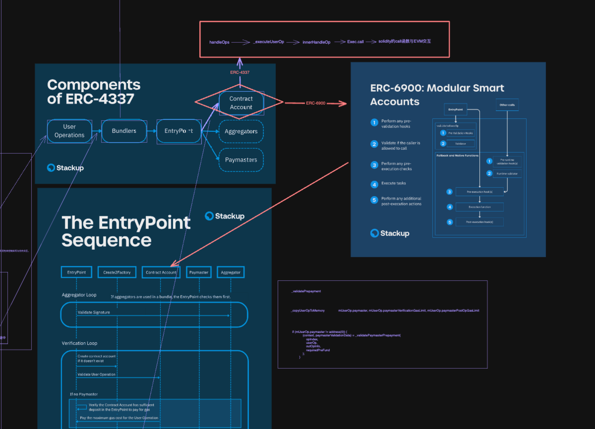
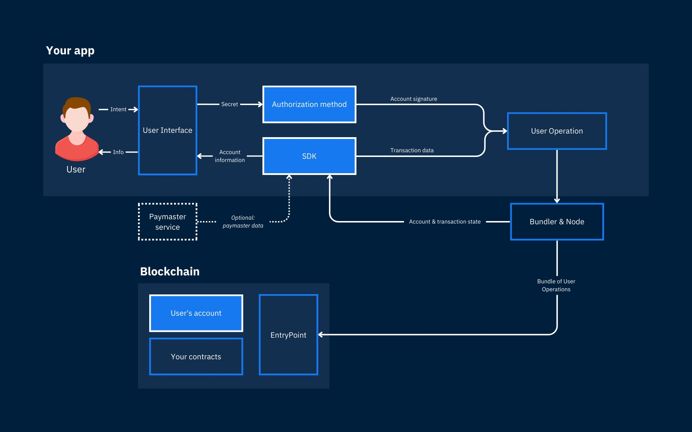

import Highlight from '@site/src/components/Highlight';


## ERC6900 摘要

1. **智能合约账户的标准化**: EIP-6900 的目标是标准化智能合约账户的结构，这可以带来更可预测的行为，并简化不同系统间的互操作性。

2. **账户插件**: 提案引入了“账户插件”的概念，这些是允许在智能合约账户中加入可组合逻辑的智能合约接口。这意味着可以以模块化的方式向智能合约账户添加各种功能，类似于软件应用程序中的插件。

3. **受 ERC-2535 启发**: 提案借鉴了 ERC-2535（钻石标准，支持模块化智能合约架构）的理念，用于定义更新和查询智能合约账户内模块化函数实现的接口。

4. **模块化方法**: 账户内的功能被划分为三个主要领域，并且这些功能在外部合约中实现。提案还概述了从这些模块化组件使用时账户应如何执行流程。

## ERC6900 动机

1. **扩展 ERC-4337**: 虽然 ERC-4337 将执行和验证逻辑抽象到单个智能合约账户，但 EIP-6900 寻求通过标准化如何在这些账户中构建附加功能来扩展这一点。

2. **通过定制实现功能**: 提案认识到账户可以具有各种功能，如会话密钥、订阅、消费限额和基于角色的访问控制，这些目前要么内置于特定的智能合约账户中，要么通过专有插件系统实现。

3. **用户体验和开发者努力**: 提案识别出一个问题，即管理具有不同功能和安全配置的多个账户实例会导致用户体验碎片化。对于开发者来说，支持多个平台可能会导致平台锁定或需要重复的开发努力。

4. **标准化的模块化账户**: EIP-6900 提出了一个模块化智能合约账户的标准，该标准可以支持所有符合标准的插件。这将增强用户的数据可移植性，并减轻插件开发者需要承诺支持特定账户实现的需求。

总结来说，EIP-6900 旨在为智能合约账户创建一个更统一和灵活的框架，使得开发者更容易创建和实现新功能，同时通过减少碎片化和复杂性来改善用户体验。

## Plugin manifest

插件清单负责描述安装期间将在 MSCA 上配置的执行函数、验证函数和钩子，以及插件的元数据、依赖项和权限。

## ERC-7579 vs ERC-6900

<a href="https://docs.zerodev.app/blog/why-7579-over-6900" target="_blank" >Why we are building Kernel on ERC-7579 (and not ERC-6900)</a>

## ERC-6900 vs ERC4337



## 架构推荐



https://docs.stackup.sh/docs/recommendations

## 谁来调用插件

在基于插件的智能合约账户系统中，插件是一种可以赋予账户额外功能的模块。这些插件可以定义新的函数，增强现有功能，或者与其他智能合约交互。当一个插件被安装到账户合约中时，它通常会注册一些函数选择器（function selectors），这些选择器与特定的函数逻辑相对应。

在这样的系统中，调用通常按以下方式进行：

1. **用户交互**：用户（或另一个合约）通过发送一个交易来调用账户合约的函数。这个交易包含了一个函数选择器和可能的参数，这些信息告诉合约需要执行哪个函数。

2. **合约逻辑**：账户合约接收到调用后，会根据传入的函数选择器确定需要执行哪个插件中的代码。这通常是通过查找一个映射（mapping）或者一个注册表（registry）来完成的，这个映射或注册表会将函数选择器与相应插件中的函数逻辑关联起来。

3. **插件执行**：一旦确定了正确的插件和函数，合约账户会执行该插件中的代码。这个过程可能涉及读取或修改合约的状态，或者与其他合约进行交互。

4. **权限和验证**：为了安全起见，合约账户可能会实施一些权限检查，以确保调用者有权执行请求的操作。这些检查可能是基于内置的权限系统，或者通过使用钩子（hooks）和验证器（validators）来实现的。

5. **钩子和事件**：在执行插件逻辑之前或之后，合约账户可能会调用一些预定义的钩子。这些钩子可以用于执行额外的检查，记录事件，或者触发其他合约的动作。

在这样的系统中，"谁来调用" 取决于交易的发起者。通常情况下，这些调用者可以是：

- **合约所有者**：拥有特定权限的用户，可以安装插件或执行特定的操作。
- **外部用户**：任何知道如何与合约交互的用户，可以调用公开的函数。
- **其他合约**：在复杂的交互模式中，一个合约可能会调用另一个合约的函数。

在基于 ERC-4337 或类似的账户抽象框架中，还可能涉及到**验证者**（Relayers），它们负责将用户操作打包并发送到区块链，用户操作可能会触发合约账户中的插件逻辑。

这种模块化的方法提供了极大的灵活性和可扩展性，因为它允许合约的功能随着时间的推移而增长和适应，而不必重新部署整个合约。

## 会不会调用到没有的插件

会，如果用户试图调用一个不存在的函数或者插件，通常会导致调用失败。在智能合约和插件系统中，通常会有以下几种方式来处理这种情况：

1. **函数选择器检查**：智能合约可以设计成在执行任何操作之前先检查函数选择器是否对应于一个有效的函数或插件。如果没有找到匹配项，合约可以优雅地拒绝交易，而不是让它失败。

2. **错误处理**：合约可以捕获错误并提供有用的反馈。例如，它可以使用 Solidity 的 `require`、`revert` 或 `assert` 语句来提供错误信息，告知用户调用失败的原因。

3. **查询接口**：合约可以提供一个查询接口，允许用户在调用之前查询可用的插件和函数。这可以通过公开的函数来完成，用户可以调用这些函数来获取当前激活的插件列表和它们提供的功能。

4. **事件日志**：智能合约可以在插件被添加或移除时发出事件。监听这些事件可以帮助用户了解合约的当前状态和可用的功能。

5. **文档和外部工具**：合约开发者通常会提供文档和外部工具，以帮助用户了解如何与合约交互，包括可用的插件和函数。

6. **权限管理**：如果某些函数或插件只对特定用户开放，合约可以实现复杂的权限管理系统来确保只有授权用户才能调用特定的功能。

7. **用户界面**：为合约提供一个友好的用户界面（如 Web 前端）可以帮助用户理解可用的操作，并防止他们意外调用不存在的函数。

8. **代理调用**：在某些高级的合约设计中，可以使用代理（proxy）模式，其中一个代理合约负责转发调用到实际的逻辑合约。如果调用失败，代理可以更优雅地处理这种情况。

通过这些方法，开发者可以最大限度地减少用户因不了解合约状态或接口而导致的错误调用。然而，这也要求合约开发者在设计时考虑到易用性和错误处理，以提供良好的用户体验。

## 合约账户的插件安装与获取

https://accountkit.alchemy.com/extending-smart-accounts/get-installed-plugins.html

## 6900-reference-implementation

https://github.com/erc6900/reference-implementation

```shell
AccountExecutor.sol
AccountLoupe.sol 账户放大镜（很形象，拿着放大镜仔细看看账户里有什么）
AccountStorage.sol
AccountStorageInitializable.sol
PluginManagerInternals.sol
UpgradeableModularAccount.sol
```

以下是每个合约可能的作用：

1. **AccountExecutor.sol**: 这个合约可能是负责执行与账户相关的操作，比如转账、调用其他合约等。Executor 通常指代执行事务的实体，所以这个合约可能包含了一些核心的逻辑，用于处理账户的交易。

2. **AccountLoupe.sol**: Loupe 在编程和智能合约的语境中通常指的是审视或检查工具。这个合约可能提供了一些只读的功能，用来检查账户的状态，例如余额、授权情况、交易历史等。

3. **AccountStorage.sol**: 这个合约很可能是用来存储账户的状态，比如余额、授权信息和其他重要数据。Storage 合约通常与逻辑合约分离，以便在升级合约时保留状态。

4. **AccountStorageInitializable.sol**: 这个合约可能是 AccountStorage 的一个变体，它添加了初始化功能。在可升级合约的模式中，初始化功能通常用来替代构造函数，确保合约在被代理合约使用时能正确地设置其初始状态。

5. **PluginManagerInternals.sol**: 这个合约可能包含了插件管理的内部逻辑。在一个模块化和可扩展的系统中，PluginManager 可能用于管理各种插件的生命周期，比如安装、更新、卸载等。

6. **UpgradeableModularAccount.sol**: 这个合约可能是一个可升级的账户合约，它支持模块化设计。这意味着合约的功能可以通过添加或替换模块来扩展，同时还支持通过某种升级机制来更新合约的逻辑而不丢失状态。

用于管理用户账户、权限、以及与特定功能模块的交互。在实际的应用中，这样的系统可能用于去中心化金融（DeFi）平台、多签钱包、企业级区块链解决方案等场景。

### AccountExecutor.sol


- <Highlight color="#25c2a0">这段代码定义了一个名为 `AccountExecutor` 的抽象合约，它包含了一个名为 `_exec` 的内部函数，用于向其他合约发送调用。</Highlight>
- <Highlight color="#25c2a0">合约的主要目的是确保调用的目标不是一个插件，以避免数据不一致和意外行为。</Highlight>
- <Highlight color="#25c2a0">如果目标合约是一个插件（通过支持 `IPlugin` 接口来判断），那么调用会被拒绝，并抛出 `PluginExecutionDenied` 错误。</Highlight>

以下是 `_exec` 函数的工作原理：

1. **检查插件接口**: 使用 OpenZeppelin 的 `ERC165Checker` 工具，`_exec` 函数首先检查目标地址是否支持 `IPlugin` 接口。如果目标合约被认定为插件，函数会立即中断执行并抛出 `PluginExecutionDenied` 错误。

2. **调用执行**: 如果目标不是插件，函数会继续使用 `call` 低级函数向目标合约发送调用。调用时，可以附带 `value`（以太）和 `data`（调用数据）。

3. **错误处理**: 如果调用失败（例如，如果被调用的合约函数中断执行并回退），`_exec` 函数会使用 `assembly` 块来直接将错误信息冒泡上来。这意味着调用者会收到原始的错误信息，而不是通用的错误。

`assembly` 块使用 `"memory-safe"` 指令来确保操作是内存安全的，这是 Solidity 0.8.x 版本引入的一个特性。`assembly` 块中的 `revert` 指令用于抛出错误，它使用 `result` 中的数据作为错误信息。`add(result, 32)` 是错误信息的起始位置，`mload(result)` 是错误信息的长度。

总结来说，`AccountExecutor` 合约提供了一种安全的执行机制，以确保智能合约系统中的模块化账户不会意外地直接调用插件，从而保持系统的完整性和预期行为。

### AccountLoupe.sol

这段代码定义了一个名为 `AccountLoupe` 的抽象合约，它实现了 `IAccountLoupe` 接口。该合约似乎是一个工具合约，用于检索有关账户执行功能配置、执行钩子（hooks）以及已安装插件的信息。它使用了 OpenZeppelin 的 `UUPSUpgradeable` 合约，这表明它是设计为可升级的，而且它与插件管理器有关，因为它引用了 `IPluginManager` 接口。

以下是合约的主要部分及其可能的作用：

1. **getExecutionFunctionConfig**: 这个函数根据传入的选择器（函数签名的前 4 个字节）返回执行函数的配置。这包括关联的插件地址、用户操作验证函数和运行时验证函数。它检查选择器是否对应于一组预定义的内部函数或插件管理器函数，如果不是，则从存储中检索相关数据。

2. **getExecutionHooks**: 这个函数返回与特定选择器相关联的执行钩子，包括执行前和执行后的钩子。这些钩子可能用于执行额外的逻辑，例如验证、状态更新或事件记录。

3. **getPreValidationHooks**: 这个函数返回与特定选择器相关联的预验证钩子，包括用户操作预验证钩子和运行时预验证钩子。这些可能用于在实际执行操作之前进行一些检查。

4. **getInstalledPlugins**: 这个函数返回所有已安装插件的地址数组。这可能用于检索合约当前使用的所有插件，以便进行管理或审计。

此外，合约使用了 OpenZeppelin 的 `EnumerableMap` 和 `EnumerableSet` 实用库来管理映射和集合，这些库提供了迭代映射和集合的功能。

错误处理：

- **ManifestDiscrepancy**: 如果插件地址与预期不符，这个错误将被抛出。

合约使用了 `assembly` 块来调整动态数组的大小，这是一个低级操作，通常用于优化目的。

总结来说，`AccountLoupe` 合约是一个为账户提供只读访问权限的工具合约，它允许外部调用者检索有关账户执行策略和已安装插件的详细信息。这种类型的合约在复杂的智能合约系统中很有用，尤其是在需要透明度和可升级性的去中心化应用程序中。

### AccountStorage.sol

这段代码是一个Solidity智能合约的一部分，它定义了一系列结构体（`structs`），这些结构体用于表示与模块化和可升级的以太坊账户相关的复杂状态。这个合约利用了 OpenZeppelin 的 `EnumerableMap` 和 `EnumerableSet` 库来管理集合和映射，以便能够枚举它们的元素。

让我们逐一看看每个结构体和函数：

#### 结构体（Structs）

1. **PluginData**:
   - `anyExternalExecPermitted`: 表示插件是否允许任何外部执行。
   - `canSpendNativeToken`: 表示插件是否可以花费原生代币。
   - `manifestHash`: 插件清单的哈希值。
   - `dependencies`: 插件依赖的函数引用数组。
   - `dependentCount`: 作为依赖函数使用的次数。

2. **PermittedExternalCallData**:
   - `addressPermitted`: 指定地址是否允许。
   - `anySelectorPermitted`: 是否允许任何选择器。
   - `permittedSelectors`: 允许的选择器映射。

3. **HookGroup**:
   - `preHooks`: 执行前的钩子。
   - `associatedPostHooks`: 与执行前钩子相关联的执行后钩子。
   - `postOnlyHooks`: 仅在执行后的钩子。

4. **SelectorData**:
   - `plugin`: 实现此执行函数的插件地址。
   - `userOpValidation`: 用户操作验证函数引用。
   - `runtimeValidation`: 运行时验证函数引用。
   - `preUserOpValidationHooks`: 执行前用户操作验证钩子。
   - `preRuntimeValidationHooks`: 执行前运行时验证钩子。
   - `executionHooks`: 执行函数的钩子。

5. **AccountStorage**:
   - `initialized` 和 `initializing`: 用于初始化状态的变量。
   - `plugins`: 插件地址集合。
   - `pluginData`: 插件数据映射。
   - `selectorData`: 选择器数据映射。
   - `callPermitted`: 允许的调用映射。
   - `permittedExternalCalls`: 允许的外部调用映射。
   - `supportedIfaces`: 用于ERC165自省的接口支持映射。

#### 函数

1. **getAccountStorage**:
   使用内联汇编和 `memory-safe` 指令，它返回一个指向预定义存储槽 `_ACCOUNT_STORAGE_SLOT` 的 `AccountStorage` 结构体的引用。

2. **getPermittedCallKey**:
   生成一个 `bytes24` 类型的键，该键由地址和选择器组成，用于在 `callPermitted` 映射中标识权限。

3. **toFunctionReferenceArray**:
   将 `EnumerableMap.Bytes32ToUintMap` 映射转换为 `FunctionReference` 数组。这用于从映射中提取所有元素并将它们存储在内存中的数组中。

总的来说，这段代码是一个高度模块化和可升级的智能合约系统的一部分，它使用复杂的状态管理来跟踪插件、执行函数、权限和钩子。这种模式允许智能合约在维护核心状态的同时，添加新功能或改进现有功能。

### AccountStorageInitializable.sol


这段代码是一个用于以太坊智能合约的初始化控制抽象合约，它确保初始化函数只能在合约生命周期中被正确地调用一次。这是为了防止在合约升级时重置或破坏合约的状态。

关键点如下：

- **AlreadyInitialized** 和 **AlreadyInitializing** 错误：用于防止重复初始化。
- **initializer** 修饰符：确保函数只在合约尚未初始化时调用。
- **_disableInitializers** 函数：用于在初始化后禁用进一步的初始化调用。

这个模式对于可升级的智能合约特别重要，因为它们需要在升级后保持状态不变，同时允许新的初始化逻辑执行。


这段代码定义了一个名为 `AccountStorageInitializable` 的抽象合约，它是一个使用初始化模式的合约，确保某些函数只能在合约生命周期中被调用一次。这是一个常见的模式，用于可升级合约，以确保在升级过程中，状态变量可以被正确地初始化，而不会被重复初始化。这个抽象合约使用了之前定义的 `AccountStorage` 结构体和 `getAccountStorage` 函数。

#### 错误定义

- **AlreadyInitialized**: 如果尝试对已经初始化的合约进行初始化，则会抛出这个错误。
- **AlreadyInitializing**: 如果在初始化过程中再次尝试初始化，则会抛出这个错误。

#### Modifier

- **initializer**:
  这个修饰符用于确保它修饰的函数只能在合约的生命周期中被调用一次。它首先检查是否是最顶层的调用（即没有其他初始化函数正在被执行），然后检查合约是否已经初始化。如果这些检查通过，它将设置 `initializing` 标志，执行函数，然后清除 `initializing` 标志。如果检查失败，则会抛出 `AlreadyInitialized` 错误。

#### 函数

- **_disableInitializers**:
  这个内部函数用于禁用初始化函数，以防止它们在合约生命周期中被再次调用。它首先检查是否正在执行初始化过程，如果是，则抛出 `AlreadyInitializing` 错误。如果不是，它会将 `_storage.initialized` 设置为 `uint8` 的最大值，从而永久禁用初始化函数。

这个合约的设计使得它可以被用作其他合约的基础，这些合约需要确保它们的初始化逻辑只被执行一次，例如在部署时或在合约升级后。这是一个关键的安全特性，用于防止在合约升级过程中的不当初始化，可能会导致合约状态被意外地篡改。

## 参考链接

1. https://github.com/erc6900/reference-implementation
2. https://docs.alchemy.com/docs/account-abstraction-overview
3. https://docs.zerodev.app/
4. https://github.com/zerodevapp/kernel
5. https://eips.ethereum.org/EIPS/eip-165
6. https://docs.stackup.sh/docs/account-abstraction
7. https://docs.stackup.sh/docs/recommendations
8. https://uniswap.org/developers
9. https://hardhat.org/hardhat-runner/docs/getting-started
